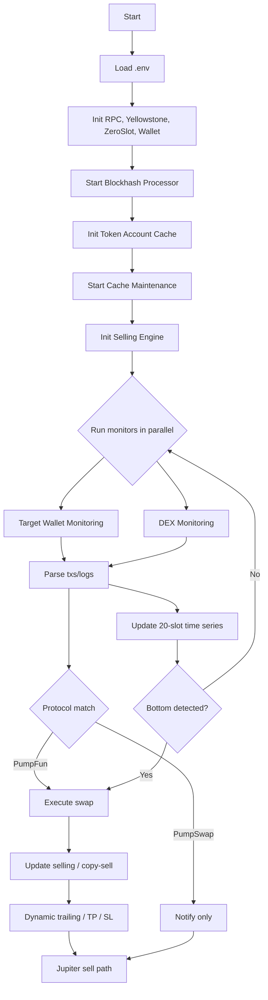

# Solana PumpFun/PumpSwap Raydium Copy/Sniper Trading Bot

High-performance Rust bot that monitors wallets and DEX activity on Solana and automatically copies/snipes trades. [📞contact me](https://t.me/av1080profit) PumpFun, PumpSwap,  Raydium launchpad, Raydium Cpmm, Raydium Amm, Meteora DBC and Meteora Damm. It integrates a configurable selling engine with dynamic trailing stops. Jupiter is used for token liquidation.  Recommended hosting service [👉 TradoxVPS](https://tradoxvps.com)

### Key Features

- **Real-time monitoring**: Yellowstone gRPC stream, parallel task processing
- **Protocols**: PumpFun (trade), PumpSwap (notify-only by default)
- **Two modes** (`MONITORING_MODE`):
  - `momentum` — pump.fun **momentum sniper** that buys *strength, not age* (no copy-trading)
  - `copy` — original target-wallet copy-trading / sniper
- **Risk & selling**: Take profit, stop loss, dynamic trailing stop, copy-selling of existing balances
- **Tx landing**: Zeroslot or normal mode, configurable priority fees
- **Utilities**: Wrap/unwrap SOL, close empty token accounts, sell all tokens via Jupiter

---

### Momentum mode (`MONITORING_MODE=momentum`)

A pump.fun engine that ignores token age, bonding stage, and migration status. It
streams every pump.fun trade, aggregates a rolling per-token picture, and scores
each token's **continuation probability (0..100)** from:

- accelerating buy pressure (buy-volume rate now vs. recent baseline)
- raw buy volume and breadth (unique buyers)
- positive market-cap velocity
- healthy holder distribution (penalizes a single wallet dominating buys)
- a coordinated-dump veto (sells overwhelming buys)

When a token clears `MOMENTUM_ENTRY_SCORE` and a slot is free, it buys
`MOMENTUM_POSITION_SIZE_SOL` (up to `MOMENTUM_MAX_POSITIONS` concurrent). Exits
optimize for **asymmetric returns**, not win rate:

- Hard stop at `MOMENTUM_HARD_STOP_PCT` (default −35%).
- Scale out 20% of the original at each of +100/+200/+300/+400%, keeping a 20% **runner**.
- Cut failed momentum fast: if the score collapses below `MOMENTUM_COLLAPSE_SCORE`
  or sells significantly exceed buys, exit the remainder regardless of rung.

**Edge mechanisms.** Beyond raw momentum, three features actively push expected
value (all toggleable in `src/env.example`):

- **Smart-money memory** (`MOMENTUM_SMART_MONEY`): the bot watches every pump.fun
  trade and grades wallets on the forward return of tokens they bought, building
  a persistent per-wallet reputation (`momentum_wallet_rep.csv`) that **compounds
  across runs**. Entries get a score boost when proven-good wallets are buying —
  the "strong wallet participation" signal, learned from real outcomes rather
  than assumed. The boost is scaled by the dump veto so it can't rescue a token
  that's being sold.
- **Insider / leader-dump exit** (`MOMENTUM_LEADER_DUMP_EXIT`): each position
  tracks the creator plus its largest early buyers; the moment those wallets
  start distributing (selling ≥ `MOMENTUM_LEADER_DUMP_SOL` in the short window),
  the bot exits *immediately*, ahead of the hard stop — shrinking losers by
  front-running the people most likely to rug.
- **Conviction sizing** (`MOMENTUM_CONVICTION_SIZING`, off by default): scales
  position size up with how far the entry score clears the bar, capped at
  `MOMENTUM_CONVICTION_MAX_MULT`.

The analyzer's "exit reasons" and "smart-money memory" sections show whether each
of these is actually earning its keep.

> These improve the EV *mechanisms* — they don't guarantee profit. Validate them
> in dry run: compare total PnL and the insider-exit category with the features
> on vs off.

**Risk controls.**
- **Global capital cap** (`MOMENTUM_MAX_DEPLOYED_SOL`, default 1.0): total SOL
  exposed across all open positions can never exceed this, even with conviction
  sizing and 5 concurrent slots. The last entry is trimmed to the remaining
  headroom, or skipped if there isn't enough.
- **Honest cost basis** (`MOMENTUM_BUY_COST_FRACTION`, default 1.5%): the entry-leg
  cost is folded into each position's cost basis, so realized PnL doesn't flatter
  the buy. Combined with on-chain sell reconciliation, PnL is conservative on both legs.
- **Scale-out integrity**: a profit rung is marked taken and the remaining
  fraction reduced *only after* the sell confirms — a failed sell never silently
  consumes a rung or corrupts position size.
- **Reputation-poisoning guard** (`MOMENTUM_SMART_MONEY_MIN_DISTINCT`, default 2):
  smart-money boost requires several distinct reputable wallets and caps any single
  wallet's contribution, so one farmed high-rep wallet can't bait the bot into a dump.

**Trade logging / PnL report.** Every buy and sell is appended to an
append-only CSV (`MOMENTUM_TRADE_LOG`, default `momentum_trades.csv`) with
columns: timestamp, event (`BUY`/`SELL_PARTIAL`/`SELL_FULL`), mint, reason,
score, entry/current market cap, PnL %, fraction of original sold, estimated SOL
proceeds, estimated realized PnL (SOL), and the tx signature. A live summary
line (cumulative realized PnL, buys/sells, open positions) is logged to the
console roughly every 60s.

Each sell is recorded twice: an immediate `SELL_PARTIAL`/`SELL_FULL` row with a
mark-to-curve **estimate**, then — once the transaction is confirmable — a
background `SELL_ACTUAL` row carrying the **true on-chain SOL proceeds** (the
wallet's net balance delta, i.e. proceeds minus fees and the priority/zeroslot
tip). The running realized-PnL tally is nudged from the estimate toward the
actual as reconciliation lands, so the live summary converges to real numbers.

**Re-entry.** Because the philosophy is to buy strength regardless of age, the
bot can re-buy a token that re-pumps after you've exited it. `MOMENTUM_ALLOW_REENTRY`
(default `true`) clears the mint from the permanent buy-blacklist after the
`MOMENTUM_REENTRY_COOLDOWN_SECS` cooldown; set it to `false` to keep the
original "never rebuy" behavior.

**Dry run — validate before risking money.** Set `MOMENTUM_DRY_RUN=true` to
paper-trade: the bot runs the full strategy against the live pump.fun stream
(real momentum, real market caps) but sends **no transactions**. Fills are
simulated at the current market cap minus `MOMENTUM_SIM_COST_FRACTION` (default
3%, covering fees + tip + slippage), and every simulated buy/sell is written to
the trade CSV exactly like a live trade. This lets you measure whether the
configuration has an edge with zero capital at risk. Flip to `false` only after
the numbers justify it.

**Analyze the results.** A zero-dependency analyzer turns the CSV into the four
questions that decide whether there's an edge:

```bash
python3 scripts/analyze_momentum.py momentum_trades.csv
```

It reports total realized PnL after costs, win/loss distribution and the biggest
winners/losers, whether higher entry scores actually predict better outcomes
(so you know which way to move `MOMENTUM_ENTRY_SCORE`), and the cost drag between
estimated and on-chain-actual proceeds. It correctly prefers `SELL_ACTUAL` rows
over estimates in live mode and reads the simulated truth in dry-run mode.

**A/B the edges.** To prove the edge mechanisms help (rather than assume it),
run two dry sessions over comparable windows with different `MOMENTUM_TRADE_LOG`
files — one with the edges on, one off — then compare side by side:

```bash
python3 scripts/compare_momentum.py on.csv off.csv --labels "edges on" "edges off"
```

It prints total PnL, win rate, and per-exit-reason PnL for both, plus the delta,
so the question "did this change move expected value?" becomes a number.

> **Recommended workflow:** run dry for a few hundred trades → analyze →
> A/B the edges on vs off → if PnL is positive, scores are predictive, and the
> edges help, tune and go live at *tiny* size (0.02 SOL) → analyze the real
> fills → only then consider scaling.

See `src/env.example` for every momentum tunable. Implementation: `src/processor/momentum.rs`.

> ⚠️ Profitability is **not** guaranteed. The thresholds are sensible starting
> points, not backtested optimums — paper-test with tiny size first and tune
> from real fills.

---

### How it works (logic)

1. Load `.env`, build `Config` and initialize clients (RPC, Yellowstone, ZeroSlot, wallet).
2. Start the `BlockhashProcessor`, token-account cache, and cache maintenance.
3. Initialize `SellingEngine` from env and optionally start copy-selling for existing tokens.
4. Launch two monitors in parallel:
   - Target wallet monitoring (`processor/sniper_bot.rs`)
   - DEX monitoring (`processor/sniper_bot.rs`), protocol auto-detection or preference
5. Parse candidate transactions/logs, filter excluded addresses and apply limits.
6. Execute swaps. Apply slippage and priority-fee settings; optionally use ZeroSlot mode.
7. Manage positions with the selling strategy (TP/SL/dynamic trailing). Liquidation paths use Jupiter.
8. Maintain a per-token 20-slot time-series (price, buy/sell volume) to detect post-drop bottoms, enabling sniper entries and informed copy trades.



---

### Project structure

```
src/
  common/                # config, constants, logger, caches
  common/timeseries.rs   # 20-slot price & volume time-series, bottom detection
  library/               # blockhash processor, jupiter client, rpc, zeroslot
  processor/             # monitoring, swap/execution, selling, risk mgmt, parsing
  dex/                   # protocol adapters: pump_fun.rs, pump_swap.rs, raydium_launchpad.rs
  block_engine/          # helpers for token accounts & txs
  error/                 # error types
  main.rs                # entrypoint & CLI helpers (wrap/unwrap/sell/close)
```

Important files:

- `src/main.rs`: starts services, parallel monitors, CLI helpers (`--wrap`, `--unwrap`, `--sell`, `--close`).
- `src/common/config.rs`: loads env, builds `Config`, RPC/yellowstone clients, wallet, slippage, fees.
- `src/processor/sniper_bot.rs`: wallet/DEX monitoring orchestration.
- `src/processor/selling_strategy.rs`: selling engine with dynamic trailing stop.
- `src/library/jupiter_api.rs`: quotes and executes swaps for liquidation.
- `src/library/blockhash_processor.rs`: keeps recent blockhashes updated.

---

### Setup

Prerequisites:

- Rust toolchain (stable), Cargo
- Access to a Solana RPC (`RPC_HTTP`) and Yellowstone gRPC endpoint

1) Clone and create env file

```bash
cp src/env.example .env
# Edit .env with your keys and endpoints
```

2) Build

```bash
cargo build --release
```

3) Run

```bash
cargo run --release
```

CLI helpers (run one at a time):

```bash
cargo run --release -- --wrap      # Wrap WRAP_AMOUNT SOL to WSOL
cargo run --release -- --unwrap    # Unwrap WSOL back to SOL
cargo run --release -- --sell      # Sell all tokens via Jupiter
cargo run --release -- --close     # Close all token accounts (excl. WSOL with balance)
```

---

### Environment variables

Copy from `src/env.example` and adjust. Key settings (not exhaustive):

- Targeting & trading
  - `COPY_TRADING_TARGET_ADDRESS`: comma-separated wallet list to follow
  - `IS_MULTI_COPY_TRADING`: `true`/`false`
  - `EXCLUDED_ADDRESSES`: comma-separated addresses to ignore
  - `COUNTER_LIMIT`: max number of trades
  - `TOKEN_AMOUNT`: buy amount (qty if `SwapInType::Qty`)
  - `SLIPPAGE`: basis points (e.g. 3000 = 30%)
  - `TRANSACTION_LANDING_SERVICE`: `0|zeroslot` or `1|normal`

- Fees & priority
  - `SELLING_UNIT_PRICE`: priority fee for selling txs (default 4_000_000)
  - `SELLING_UNIT_LIMIT`: compute units for selling
  - `ZERO_SLOT_TIP_VALUE`: tip used in zeroslot mode

- Selling strategy
  - `COPY_SELLING_LIMIT`: initial multiple to start copy-selling
  - `TAKE_PROFIT`, `STOP_LOSS`, `MAX_HOLD_TIME`
  - `DYNAMIC_TRAILING_STOP_THRESHOLDS`: e.g. `20:5,50:10,100:30,200:100,500:100,1000:100`
  - `DYNAMIC_RETRACEMENT_PERCENTAGE`, `RETRACEMENT_PNL_THRESHOLD`, `RETRACEMENT_THRESHOLD`
  - `MIN_LIQUIDITY`
  - Time-series bottom detection (optional, future envs): `BOTTOM_MIN_DROP_PCT`, `BOTTOM_SELL_DECLINE_PCT`, `BOTTOM_STABILIZE_SLOTS`

- Sniper focus
  - `FOCUS_DROP_THRESHOLD_PCT`: fraction drop to mark token as dropped
  - `FOCUS_TRIGGER_SOL`: buy trigger size after drop (in SOL)

- Endpoints
  - `RPC_HTTP`: HTTP RPC endpoint
  - `RPC_WSS`: optional WSS endpoint
  - `YELLOWSTONE_GRPC_HTTP`: Yellowstone gRPC URL
  - `YELLOWSTONE_GRPC_TOKEN`: Yellowstone token
  - `ZERO_SLOT_URL`, `ZERO_SLOT_HEALTH`: ZeroSlot endpoints

- Wallet
  - `PRIVATE_KEY`: base58-encoded keypair string
  - `WRAP_AMOUNT`: SOL amount for `--wrap`

Example `.env` snippet:

```env
RPC_HTTP=https://rpc.shyft.to?api_key=YOUR_API_KEY
YELLOWSTONE_GRPC_HTTP=https://grpc.ny.shyft.to
YELLOWSTONE_GRPC_TOKEN=YOUR_GRPC_TOKEN
PRIVATE_KEY=YOUR_BASE58_PRIVATE_KEY

COPY_TRADING_TARGET_ADDRESS=ADDRESS1,ADDRESS2
IS_MULTI_COPY_TRADING=true
EXCLUDED_ADDRESSES=675kPX9MHTj...,CPMMoo8L3F...

TOKEN_AMOUNT=0.001
SLIPPAGE=3000
TRANSACTION_LANDING_SERVICE=zeroslot
SELLING_UNIT_PRICE=4000000
SELLING_UNIT_LIMIT=2000000
ZERO_SLOT_TIP_VALUE=0.0025

TAKE_PROFIT=8.0
STOP_LOSS=-2
MAX_HOLD_TIME=3600
DYNAMIC_TRAILING_STOP_THRESHOLDS=20:5,50:10,100:30,200:100,500:100,1000:100
```

---

### Notes

- PumpSwap is configured as notification-only by default. Extend `dex/pump_swap.rs` to enable execution.
- Ensure your `PRIVATE_KEY` is a base58 string of sufficient length; the app validates it at startup.
- If `SLIPPAGE` exceeds 10000 (100%), it is capped.

---

### License

For personal/educational use. Review and comply with your jurisdiction and exchange/DEX terms.
